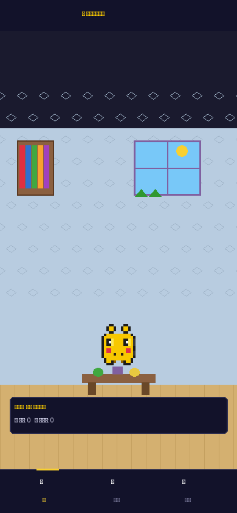
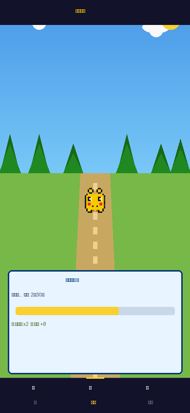
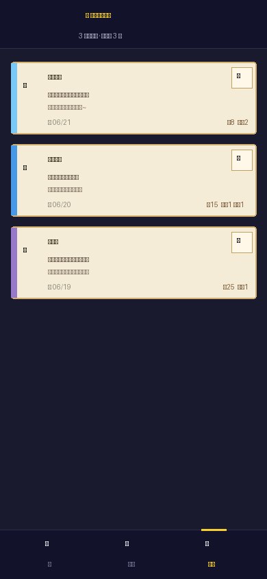

# ⚡ 皮卡丘的旅行

> 像素风 iPhone 游戏 · 旅行青蛙玩法 · GBA 宝可梦红/蓝/绿宝石画风

一款用 **Swift + SpriteKit** 原生开发的 iOS 游戏。玩法参考旅行青蛙：为皮卡丘准备行囊、送它出发旅行、等待它带着明信片和礼物回家。

---

## 截图

| 主页 | 旅行中 | 明信片相册 |
|:---:|:---:|:---:|
|  |  |  |

---

## 游戏特色

- **像素风皮卡丘** — 16×20 手绘点阵，GBA 红/蓝/绿宝石配色（金黄 #F8C800、红腮 #E03048）
- **旅行青蛙玩法** — 整理行囊 → 送皮卡丘出发 → 实时倒计时 → 收集明信片
- **3 个目的地**
  - 🌲 常磐森林（3 分钟）
  - 🌊 华蓝海岬（10 分钟）
  - 🌙 月亮山（20 分钟）
- **明信片系统** — 旅行结束随机获得专属明信片 + 浆果/金币奖励
- **存档系统** — 关闭 App 重新打开，旅行仍在继续；离线期间结束的旅行自动结算

---

## 技术栈

| 技术 | 用途 |
|------|------|
| Swift 5 | 主要开发语言 |
| SpriteKit | 2D 游戏渲染引擎 |
| UIGraphicsImageRenderer | 像素艺术纹理生成 |
| SKTexture `.filteringMode = .nearest` | 像素艺术锐化（无抗锯齿） |
| UserDefaults + Codable | 本地存档 |
| xcodegen | 从 `project.yml` 生成 `.xcodeproj` |

---

## 环境要求

| 要求 | 版本 |
|------|------|
| macOS | 13 Ventura 及以上 |
| Xcode | 15 及以上 |
| iOS 部署目标 | iOS 16+ |
| Apple Developer 账号 | 免费账号即可（真机调试） |

---

## 运行方式

### 方法一：直接在 Xcode 打开（推荐）

```bash
# 1. 克隆仓库
git clone https://github.com/R1chi33333/pokemon-journey-ios.git
cd pokemon-journey-ios
```

然后：

1. 双击 `PokemonJourney.xcodeproj` 用 **Xcode** 打开
2. 用 USB 线连接你的 iPhone
3. 顶部设备选择栏选择你的 iPhone
4. 点击左上角 **▶️ Run** 按钮

首次运行需要配置签名：
- 选中左侧 `PokemonJourney` target
- 点击 `Signing & Capabilities`
- `Team` 下拉选择你的 **Apple ID**（免费账号即可）
- Xcode 会自动处理签名，点击 ▶️ 即可安装到手机

### 方法二：重新生成 Xcode 项目（如果 .xcodeproj 有问题）

```bash
# 安装 xcodegen
brew install xcodegen

# 克隆项目
git clone https://github.com/R1chi33333/pokemon-journey-ios.git
cd pokemon-journey-ios

# 重新生成 .xcodeproj
xcodegen generate

# 用 Xcode 打开
open PokemonJourney.xcodeproj
```

### 模拟器运行

在 Xcode 顶部设备栏选择任意 **iPhone Simulator**，点击 ▶️ 即可在 Mac 上模拟运行（无需真机）。

---

## 项目结构

```
PokemonJourney/
├── project.yml                  # xcodegen 配置
├── PokemonJourney.xcodeproj/    # Xcode 项目文件
├── screenshots/                 # 游戏截图
└── PokemonJourney/
    ├── AppDelegate.swift        # App 入口
    ├── SceneDelegate.swift      # 窗口创建
    ├── GameViewController.swift # SKView 容器
    ├── Info.plist
    ├── Assets.xcassets/
    │   └── AppIcon.appiconset/  # 应用图标（9 个尺寸）
    ├── Game/
    │   ├── GameState.swift      # 所有数据模型（Codable）
    │   ├── GameManager.swift    # 游戏逻辑单例
    │   ├── GameStorage.swift    # UserDefaults 存档
    │   ├── PixelArtRenderer.swift  # 像素艺术渲染器
    │   └── PixelArtData.swift   # 皮卡丘像素数据 + 调色板
    └── Scenes/
        ├── HomeScene.swift      # 主页（皮卡丘房间）
        ├── JourneyScene.swift   # 旅行场景（倒计时 + 步行动画）
        └── AlbumScene.swift     # 明信片相册
```

---

## 游戏玩法说明

```
主页
 ├── 查看皮卡丘状态和心情
 ├── 背包区域：点击道具装入/取出行囊
 ├── 点击「去旅行！」按钮
 │    └── 弹出目的地选择面板
 │         ├── 常磐森林 🌲  3 min
 │         ├── 华蓝海岬 🌊  10 min
 │         └── 月亮山   🌙  20 min
 └── 出发后自动跳转旅行场景

旅行场景
 ├── 皮卡丘像素步行动画
 ├── 实时倒计时 + 进度条
 ├── 旅行结束 → 弹出奖励面板
 │    ├── 随机获得明信片（30~80% 概率）
 │    ├── 金币奖励
 │    └── 浆果奖励（奥兰果 / 蜜桃果 / 吉利果）
 └── 点击「回家」返回主页

明信片相册
 └── 上下滑动浏览所有明信片
      ├── 地点 / 日期 / 皮卡丘的话
      └── 本次旅行的奖励记录
```

---

## 开发者说明

代码使用纯 Swift 编写，**无第三方依赖**，像素艺术完全由代码生成（不依赖任何图片素材）。

皮卡丘像素数据在 `PixelArtData.swift` 中以字符串数组形式存储，调色板映射每个字符到具体颜色，渲染时通过 `UIGraphicsImageRenderer` 将每个像素绘制为固定大小的色块，配合 `SKTexture.filteringMode = .nearest` 保持像素风锐利边缘。

---

## License

MIT License · 仅用于学习/展示目的 · 皮卡丘版权归任天堂/Game Freak 所有
